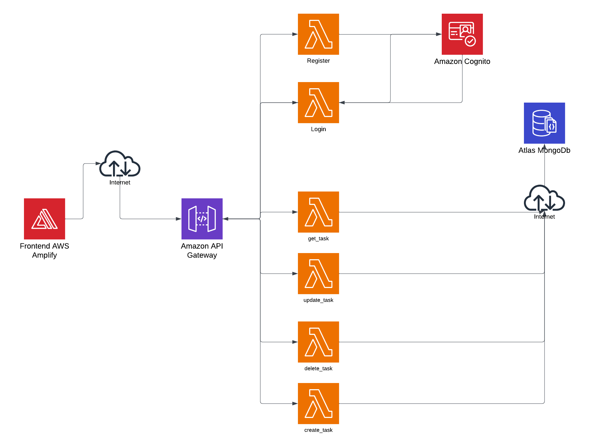

# Task Manager Application

A full-stack task management application built with a React frontend and AWS Lambda serverless backend.

## Architecture

The application consists of:

- **Frontend**: React application deployed on AWS Amplify
- **Backend**: Serverless application using AWS Lambda functions, API Gateway and Cognito for authentication
- **Database**: MongoDB Atlas for data storage

### Key Components:

1. **Frontend (AWS Amplify)**
   - React.js application with TypeScript
   - Material UI for component styling
   - Redux for state management
   - Deployed using AWS Amplify

2. **Backend (AWS Lambda)**
   - Serverless functions for authentication and task operations
   - API Gateway for HTTP request routing
   - AWS Cognito for user authentication and authorization
   - Mongodb Atlas for data storage

3. **API Endpoints**
   - Authentication endpoints for user registration and login
   - Task management endpoints (get, create, update, delete)

## Getting Started

This repository contains both the frontend and backend code for the Task Manager application. Please refer to their respective README files for detailed setup instructions:

- [Backend README](./backend/README.md)
- [Frontend README](./frontend/README.md)

## Deployment

The application is designed to be deployed on AWS using:

1. AWS Amplify for the frontend
2. Serverless Framework for the backend Lambda functions

Refer to the CloudFormation templates in the AWS directory for infrastructure as code setup.

## License

This project is licensed under the MIT License. 